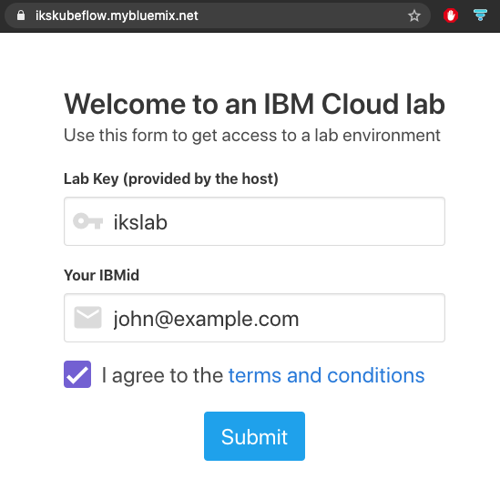

# Deploy Kubeflow on IBM Cloud

## Access to IBM Cloud workshop cluster

If you already have access to an IBM Cloud Kubernetes cluster, please use it for the following experiment. If not, you will be provided a cluster just for the purpose of this handson.

* Create an `IBMid`

(Optional) If you do not have an `IBMid`, go to [IBM Cloud](https://ibm.biz/Bdqgck) to create an account to access IBM Cloud clusters. For IBM internal developers, you can use your internet id with SSO to access IBM Cloud.

* Install CLI tools to access IBM Kubernetes cluster

```shell
curl -sL https://ibm.biz/idt-installer | bash
```

* Login to IBM Cloud

```shell
ibmcloud login -a cloud.ibm.com -r us-south -g default

# if you have a federated id
# ibmcloud login -a cloud.ibm.com -r us-south -g default --sso
```

* Request access to a workshop cluster

(Optional) There are a limited number of workshop clusters for the live dojo session. If you need the access to one of the clusters, open your browser with `https://ikskubeflow.mybluemix.net`, enter `ikslab` as the lab key and your IBMid email to request a cluster .

Once the request gets through, follow the `IBM Cloud account` link to view the cluster info .

* Access the cluster

```shell
ibmcloud ks cluster config --cluster <cluster_name/id>
```
Replace the `<cluster_name/id>` with the cluster name or id provided to you.

## Set up IBM Cloud Block Storage

* Install `Helm` with these [instructions](https://helm.sh/docs/intro/install/)

```shell
# on MacOS
brew install helm
```

* Install IBM Cloud Block Storage

```shell
# add helm charts
helm repo add iks-charts https://icr.io/helm/iks-charts
helm repo update

# install
helm install 1.6.0 iks-charts/ibmcloud-block-storage-plugin -n kube-system
```

* Make the IBM Cloud Block Storage the default `storageclass`

```shell
kubectl patch storageclass ibmc-block-gold -p '{"metadata": {"annotations":{"storageclass.kubernetes.io/is-default-class":"true"}}}'
kubectl patch storageclass ibmc-file-bronze -p '{"metadata": {"annotations":{"storageclass.kubernetes.io/is-default-class":"false"}}}'
```

## Install Go tools

* Install `go` following this [link](https://golang.org/dl/)

  After install, do following to set up the environment
  
  ```shell
  mkdir -p $HOME/go/src
  export GOPATH=$HOME/go
  ```

## Build `kfctl`

* Clone and build `kfctl`

  - Clone

  ```shell
  cd $GOPATH/src
  mkdir -p github.com/kubeflow
  cd github.com/kubeflow
  git clone https://github.com/kubeflow/kfctl.git
  ```

  - Build

  ```shell
  cd kfctl
  make build
  export PATH=$PWD/bin:$PATH
  ```

## Deploy Kubeflow with `kfctl` CLI

* Run the deployment with application manifests specified for IBM Cloud

```shell
cd $HOME
mkdir kfdef
cd kfdef
kfctl apply -V -f https://raw.githubusercontent.com/IBM/KubeflowDojo/master/manifests/kfctl_ibm_tekton.yaml
```

* Check the deployment

```shell
kubectl get ns
kubectl get pods -n istio-system
kubectl get pods -n kubeflow
```

Wait until all pods and services are up and running in the `kubeflow` namespace than continue to the next steps.

* Access Kubeflow dashboard

  Thereare two approaches to access the dashboard. To access the dashboard with the cluster ip, run following:

  - Retrieve cluster ip

  ```shell
  export CLUSTER_IP=$(kubectl get node -o wide|grep Ready|awk '{print $7; exit}')
  ```

  Now you can access the dashboard through `http://$CLUSTER_IP:31380`.

  Another approach is to use port forwarding as follow:

  - Port forward `istio-ingressgateway`

  ```shell
  kubectl port-forward --namespace istio-system $(kubectl get pod --namespace istio-system --selector="app=istio-ingressgateway" --output jsonpath='{.items[0].metadata.name}') 8080:80&
  ```

  - Access the dashboard through `localhost:8080`

Follow the instructions to have the profile namespace created and run a pipeline tutorial.

## Deploy Kubeflow with Kubeflow operator

* Delete the current Kubeflow

```shell
cd kfdef
kfctl delete -f kfctl_ibm_tekton.yaml

kubectl delete mutatingwebhookconfigurations --all
```

* Follow the [instructions](https://github.com/kubeflow/kfctl/blob/master/operator.md) to deploy the Kubeflow operator

```shell
cd $GOPATH/src/github.com/kubeflow/kfctl
export OPERATOR_NAMESPACE=operators
kubectl create ns ${OPERATOR_NAMESPACE}

cd deploy/
kustomize edit set namespace ${OPERATOR_NAMESPACE}
kustomize build | kubectl apply -f -
```

* Check `${OPERATOR_NAMESPACE}` for the operator

```shell
kubectl get pods -n ${OPERATOR_NAMESPACE}
```

* Deploy Kubeflow with the operator

```shell
cd $HOME/kfdef
rm -rf .cache kustomize
# wget https://raw.githubusercontent.com/kubeflow/manifests/master/kfdef/kfctl_ibm.yaml
sed -i '' '/metadata:/a\'$'\n\  ''name: kubeflow\'$'\n' kfctl_ibm.yaml

KUBEFLOW_NAMESPACE=kubeflow
kubectl create ns ${KUBEFLOW_NAMESPACE}
kubectl create -f kfctl_ibm.yaml -n ${KUBEFLOW_NAMESPACE}
```

* Watch the progress

```shell
kubectl logs deployment/kubeflow-operator -n ${OPERATOR_NAMESPACE} -f
```

## Use `tekton pipelines`

* Install CLI follow the [instructions](https://github.com/tektoncd/cli#installing-tkn)

```shell
# on MacOS
brew tap tektoncd/tools
brew install tektoncd/tools/tektoncd-cli
```

* Access `tekton dashboard`

```shell
kubectl port-forward -n tekton-pipelines svc/tekton-dashboard 9097:9097&
```

To access, from browser [`http://localhost:9097`](http://localhost:9097).

## `kfctl` source code walkthrough with VSC

- Install `Go` extension
- Open the folder to `$GOPATH/src/github.com/kubeflow/kfctl`
- Run/Debug test from the IDE
- Debug within VSC

Refer to [Kubeflow on IBM Cloud](https://www.kubeflow.org/docs/ibm/install-kubeflow/) for all details.
